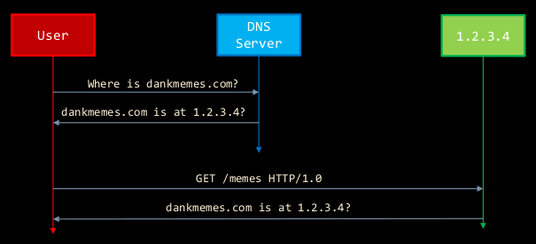
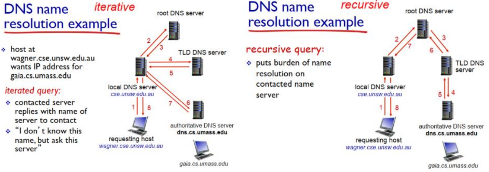
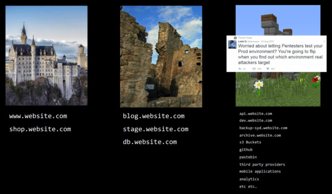
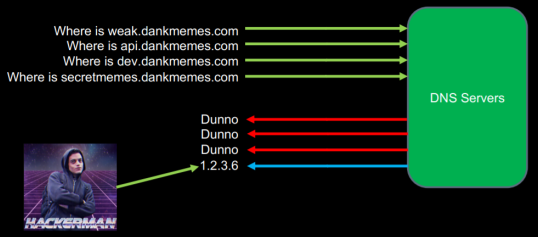
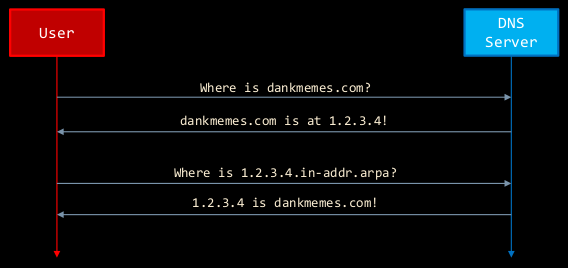

# Recon

**Recon** (or **reconnaissance**) is the act on conducting preliminary exploration of a potential target.

Jump to [checklist](#recon-checklist)

## Threat Modelling

**Thread modelling** is a process by which potential threats, such as structural vulnerabilities or the absence of appropriate safeguards, can be identified, enumerated, and mitigations can be priorities. Threat modelling answers questions like "Where am I most vulnerable to attack?", "What are the most relevant threats?", and  "What do I need to do to safeguard against these threats?"

Generally speaking, it is the process of identifying weaknesses and prioritising fixes against these weaknesses

Threat modelling methods are used to create:

* an abstraction of the system
* profiles of potential attackers, including their goals and methods
* a catalog of potential threats that may arise

## The Modern Web

The modern web is implemented in a client-server model, where the client is a browser that requests, receives and displays Web objects, and the server sends objects in response to requests.

HTTP is a web protocol that sends requests and receives responses.

A HTTP request for www.news.com.au:

``` http
GET / HTTP/1.1
Host: www.news.com.au
User-Agent: Mozilla/5.0 (X11; Ubuntu; Linux x86_64; rv:76.0) Gecko/20100101 Firefox/76.0
Accept: text/html,application/xhtml+xml,application/xml;q=0.9,image/webp,*/*;q=0.8
Accept-Language: en-GB,en;q=0.5
Accept-Encoding: gzip, deflate
Connection: close
Cookie: nk=ab90da3e0150d5e72355933d25010d66
Upgrade-Insecure-Requests: 1
```

A HTTP response from www.news.com.au:

``` http
HTTP/1.1 200 OK
Server: nginx
Content-Type: text/html; charset=UTF-8
Set-Cookie: nk=ab90da3e0150d5e72355933d25010d66; expires=Fri, 02 Jun 2023 05:33:21 GMT; path=/; domain=news.com.au; SameSite=None; Secure;
X-Content-Type-Options: nosniff
Content-Security-Policy: block-all-mixed-content; style-src https: 'unsafe-inline'; script-src https: blob: 'unsafe-inline' 'unsafe-eval'; img-src https: data:; frame-src https:;
X-Content-Security-Policy: block-all-mixed-content; style-src https: 'unsafe-inline'; script-src https: blob: 'unsafe-inline' 'unsafe-eval'; img-src https: data:; frame-src https:;
X-Webkit-CSP: block-all-mixed-content; style-src https: 'unsafe-inline'; script-src https: blob: 'unsafe-inline' 'unsafe-eval'; img-src https: data:; frame-src https:;
is-https: true
Vary: User-Agent
X-ARRRG1: /blaize/decision-engine?path=https%3a%2f%2fwww.news.com.au%2f&blaizehost=cdn.theaustralian.newscorp.blaize.io&content_id=&session=ab90da3e0150d5e72355933d25010d66
X-ac: 1.syd _bur
X-XSS-Protection: 1
Vary: Accept-Encoding
Expires: Tue, 02 Jun 2020 05:33:21 GMT
Cache-Control: max-age=0, no-cache, no-store
Pragma: no-cache
Date: Tue, 02 Jun 2020 05:33:21 GMT
Connection: close
Connection: Transfer-Encoding
Content-Length: 161889

<!doctype html><html lang="en"><head><meta charset="utf-8"> ...
```

## DNS

The **Domain Name System (DNS)** is a naming system for computer, services or other resources connected to the Internet or a private network. It is commonly used to translate user-supplied hostnames to IP addresses and vice versa.



Each device connected to the Internet has a unique IP address which other machines use to find the device.

### DNS Hierarchy

The DNS uses a large number of servers, organised in a ***hierarchical*** fashion. No single DNS has all of the mappings for all the hosts in the Internet. Instead the mappings are distributed across DNS servers.

There are 3 classes of DNS servers organised in hierarchy:

* **root DNS servers** - they provide the IP addresses of the top-level domain severs. Its location is hard-wired into other servers.
* **top-level domain (TLD) DNS servers** - for each top-level domain (e.g. .org, .com, .net, .edu, .gov, all country domains etc.) there is a TLD server. TLD servers provide the IP address of authoritative DNS servers and are managed professionally
* **authoritative DNS servers** - every organisation with publicly accessible hosts (such as Web and mail servers) on the Internet must provide publicly accessible DNS records that map the names of those hosts to IP addresses. An organisation's authoritative DNS server houses these DNS records. A organisation can choose to implement their own authoritative DNS server or pay to have these records stored in an authoritative DNS server of some service provider.

### DNS Record Types

* **A** (Address Mapping) - also known as DNS host record; stores a hostname and corresponding IPv4 address
* **AAAA** (IPv6 Address Mapping)- stores a hostname and corresponding IPv6 address
* **CNAME** (Canonica Name) - can be used to alias a hostname to another hostname. When a DNS client requests a record that contains a CNAME, which points to another hostname, the DNS resolution process is repeated with the new hostname.
* **MX** (Mail Exchange) - Specifies which SMTP email server(s) to attempt to use to deliver mail to when this type of request is made  
Requires a ***priority*** value as part of their entry. Priority is used to indicate which of the servers the MX records should attempt to use first
* **NS** (Name Server) - specifies a DNS Zone, such as "example.com" is delegated to a specific Authoritative Name Server, and provides the address of the name server
* **PTR** (Reverse-lookup Pointer) - allows a DNS resolver to provide an IP address and receive a hostname
* **CERT** (Certificate) - stores encryption certificates
* **SRV** (Service Location) - service location record, like MX but for other communication protocols
* **TXT** (Text) - used to store any text-based information that can be grabbed when necessary. Commonly used to hold SPF data and verify domain ownership>
* **SOA** (Start of Authority) - appears at the beginning of a DNS zone file, and indicates the Authoritative Name Server for the current DNS zone, contact detail for the domain administrator, domain serial number, and information on how frequently DNS information for this zone should be refreshed

### DNS Query Resolution

A host name can be resolved through **iterative queries** or **recursive queries**.



In theory, any DNS query can be iterative or recursive, but in practice, queries are typically iterative to reduce the burden of name resolution on the root server.

It is not uncommon for DNS servers to cache records to improve delay performance and to reduce the number of DNS queries.

### SPF, DKIM, DMARC

SPF, DKIM, and DMARC are  email security protocols.

**Sender Policy Framework (SPF)** hardens your DNS servers and restricts who can send emails from your domain. SPF can prevent domain spoofing. It enables your mail server to determine when a message came from the domain that it used.

**DomainKeys Identified Mail (DKIM)** ensures that the content of your emails remain trusted and hasn't been tampered with or compromised.

**Domain-based Message Authentication, Reporting and Conformance (DMARC)** ties the first two protocols with a consistent set of policies. It also links the sender's domain name with what is listed in the `From:` header and also has some better reporting back from mail recipients.

A summary:

* SPF - specifies the servers that can send emails for a domain
* DKIM - verifies that message content is authentic and not changed
* DMARC - verifies how your domain handles suspicious incoming emails

Querying these protocols via `dig`:
Note: replace `selector` and `domain` with the corresponding DKIM selector and domain you would like to lookup

``` sh
# SPF
dig domain txt

# DKIM
dig selector._domainkey.domain

# DMARC
dig _dmarc.domain
```

### Subdomains

A **subdomain** is a domain that is part of another (main) domain.  
Basically an additional part to your main domain name. They are created to organise and navigate different sections of your websites. E.g. store.yourwebsite.com - 'store' is the subdomain, 'yourwebsite' is the primary domain and '.com' is the top level domain (TLD)

Subdomains are different from directories. E.g example.com/yn points to a directory within the example.com domain, not to a subdomain of example.com.

Finding subdomains is a useful for reconnaissance. Why?  
Because security is usually focused on the main domains, leaving subdomains to be less secure and more vulnerable.



We can obtain subdomains through the following methods:

* brute forcing - using a list of subdomains, we send requests to the DNS, if the DNS responds, we know the subdomain exists  

* reverse ip - identify hostnames that have DNS records associated with an IP address

* search engines
    * Web Searches
        * inurl:, is a Google Search operator which can be used to filter Google's search results to identify low-hanging fruit  
        `site: www.mypage.com InURL: “my search term” filetype:pdf`
        * web.archive.org
    * Domain Searches
        * <https://dnsdumpster.com/>
        * <https://hackertarget.com/ip-tools/>
    * Certificates - **certificate transparency** is an Internet security standard and open source framework for monitoring and auditing digital certificates. The standard creates a system of public logs that seek to eventually record all certificates issued by publicly trusted certificate authorities, allowing efficient identification of mistakenly or maliciously identified certificates.
        * [crt.sh](https://crt.sh/)
        * Domains from shared certs

Here are some scripts that enumerate subdomains:

* [subbrute](https://github.com/TheRook/subbrute)
* [Sublist3r](https://github.com/aboul3la/Sublist3r)
* [knock](https://github.com/guelfoweb/knock)

Be sure to have a look at their implementation to better understand the tools.

Intuition is sometimes better than tools. Always manually look at the applications and get a feel for their functionality

### Content Enumeration

**Enumeration** is defined as a process which establishes an active connection to the target hosts to discover potential attack vectors in the system. It is used to gather the following information

* usernames, group names
* hostnames, machine names
* network resources
* network shares and services
* IP tables and routing tales

The gathered information is used to identify the vulnerabilities or weak points in system security and tries to exploit

Enumeration can be:

* **Active**: tries millions of combinations of words/characters
    * dirb
    * dirbuster
    * gobuster
    * fierce.pl
* **Passive**: watches for new URL’s as you browse a website
    * Burpsuite
    * LinkFinder
    * lots of open source alternatives

Enumeration pro tips:

* localisation (by a different developer)
* technology-specific things
    * Wordpress/Drupa Admin, Themes
    * Build a set of working exploits
* Databases/Data stores (e.g. s3 buckets)
* Legacy applications
* Mismatched technology stacks
* others

## Recon Checklist

* [ ] Direct site links
* [ ] Certificate transparency ([crt.sh](crt.sh))
* [ ] Brute force incl. subdomains, subdirectories etc.
* [ ] Developer Tools
    * [ ] View page source for comments or subdirectory files
    * [ ] Console
    * [ ] Subdirectory files
    * [ ] `robots.txt`
    * [ ] Cookies
* [ ] Email protocols (SPF, DKIM, DMARC)

## Basic Tests

***Vulnerabilities arise when assumptions are challenges.***

For example, if we are given a prompt that asks for your name ,the expectation is that we enter a name with alphabetical characters.
However, we can enter other excellent names:

* Null byte
* Newline
* XML/JSON/SQL
* OS Commands
* Backticks (Unix)
* Large/small names
* Strange character sets

A quick informal "sniff" test for inputs is using **``‘”>1#--;`wget blah`\x00\nabc``** as input.  
This is **not** a definitive test of whether a website is safe.  
It's a test of whether a website makes any attempt to handle unexpected input.

* Does the HTML Layout break? You may have cross-site scripting
* Do you get a database error? You may have SQL Injection
* Does your call-back get pinged? Congratulations, assume it's compromised

(*Make sure to use a proxy - browsers may modify your request*)

## Securing The Perimeter

Fix the low-hanging fruit first:

* Delete content that isn’t necessary.
* Restrict access to non-hardened content.
* Test your applications, fix the bugs.

Change user behaviour:

* Use secure passwords (admin:admin is not ok).
* Patch your environment.

BeyondCorp <https://cloud.google.com/beyondcorp/>

Never blame users for unintentional/uninformed failure.

## Disrupting Nation State Hackers

Video link: <https://www.youtube.com/watch?v=bDJb8WOJYdA>

If you want to protect your network, you need to ***really*** know your network; know the devices, security, technology, everything inside it.

Intrusion phases:

**1. Reconnaissance** - understand the target  
There is a difference between what you intend your networks to use and what the network actually uses. Evaluate what you will use, lock down and disable what you won't be using

**2. Initial exploitation** - find a way to get inside the network.  
This can happen from

* spear fishing
* water holing
* exploiting a known CVE (common vulnerabilities and exposures)
* SQL injection
* exploiting zero day

The most common intrusions are

* email - user clicks on something they shouldn't've
* website - malicious website
* removable media - inserting contaminated media

Defence mechanisms:

* Do not rely on the user to make the right decisions
* anti-exploitation features like [Microsoft EMET](https://support.microsoft.com/en-au/help/2458544/the-enhanced-mitigation-experience-toolkit)
* Take advantage of software improvements (preferably as a background activity outside the users control)
* Use a secure host baseline
* Have processes and plans to understand what is normal for your network; e.g. if someone has credentials re they operating in the norm for their credentials
* Segmenting off portions of a network, whitelisting
* Don't hardcode and include things in scripts
* Enable logs, and **look at them**

**3. Establish persistence** - being in the network is not enough. Stay in the network, privilege escalate, find run keys, scripts etc.

Defence mechanisms:

* Segmenting off portions of a network
* Application whitelisting

**4. Install Tools** - bring in tools that will do the work

Defence mechanisms:

* Reputation services - every software that wants to run on your machine gets hashed and pushed to the cloud

**5. Move Laterally** - find the things you need to find

Defence mechanisms:

* Network segmentation
* Monitoring
* Access privileges - limit admin privileges, segment accesses, enforce 2FA
* Manage trust relationships between accounts

**6. Collect exfil and exploit** - once your in the network, get what you need and get out undetected

Defence mechanisms:

* Off-site backups
* Have a plan to deal with data corruption, data manipulation or data destruction
* Differentiate between criminals and nation-state intruders
* Defend, improve, evaluate
