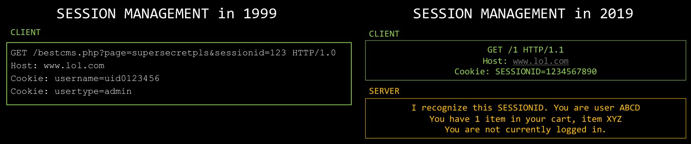

# Authentication, Session Management and Authorisation

## Overview

1. Authentication - is the user who they claim to be? If not then 401 error
2. Session Management - is it still that user?
3. Access Control - is that user allowed to access this thing?

### What Happens When You Type a URL in Your Browser?

The browser cache is checked
OS cache, followed by router cache

1. You enter a URL into a browser
2. The browser obtains the IP address of the domain name by
    1. Checking the cache for a DNS record to find the corresponding IP address  
    Caches include:
        1. browser cache
        2. OS cache
        3. router cache
        4. DNS server cache
    2. Looking up the IP address for the domain name via DNS
3. The browser initiates TCP/IP connection to the server (SYN, SYNACK, ACK)
4. The browser sends a HTTP request
5. The server sends a HTTP response
6. The browser begins rendering the HTML
7. The browser sends requests for additional objects embedded in HTML (images, css, JavaScript) and repeats steps 3-5.
8. Once the page is loaded, the browser sends further async requests as needed

## Web Authentication

In 2020 web authentication is usually done with the following methods:

* Username / Password
    * Password reset via email
    * 2FA: SMS, Token, Apps (incl TOTP)
    * Active vs Passive 2FA
* Authentication can be delegated (e.g. SSO, Oauth, JWT)
    * OAuth - a standard that works over HTTPS and authorises devices, APIs, servers, and applications with **access tokens** instead of credentials.  
    e.g. Logging onto a website using another website's/service's logon
* CAPTCHAs Sometimes
    * JWT - a standard that defines a way for securely transmitting information between parties as a JSON object. Information can be verified and trusted because it is digitally signed.

### Passwords

"The ASD's investigation found that Internet-facing services still had their default passwords, `admin:admin`, and `guest:guest`"

*Password security is a "people problem".*

When it comes to password resets we need to be mindful of the following things:

* is the reset link generated securely
* are "security" questions really secure?
    * can I get them off a user's Facebook?
    * can I Google the answers?
    * how many attempts do I get to answer these questions

Passwords obtained from previous data breaches can be found on [haveibeenpwnd.com](https://haveibeenpwned.com/Passwords)

[Password auditing](https://youtu.be/IchpQBbGbrE) also reveals that many user passwords can easily be found by matching hashes with rainbow tables (a precomputed dictionary of plaintext passwords and their corresponding hash values).

The 2019 NIST password guidelines recommends:

* 8 character min (human) otherwise 6 character min
* Support at least 64 characters max length
* Support All ASCII characters (incl 0x20)
* **NO** truncation of password when processed
* Allow at least 10 password attempts before lockout
* No SMS for 2FA (one-time password from an app)

Additionally:

* Check password with known dictionaries
* No complexity requirements (as it makes passwords harder to remember)
* No password expiration period
* No password hints
* No knowledge-based authentication (no questions) (these are easily obtainable via social engineering)

A study was conducted, notifying users with weak passwords to change their passwords. Here are the results


### Attacking Passwords

When attacking passwords **brute force** is the ***best force***.

* Attempt logins with common passwords
* Try known email + password combinations from previous breaches
    * **Brute force** - one user, many passwords
    * **Credential stuffing** - many users, many passwords  
* Enumeration via information disclosure  
Error messages such as "Login failed: invalid username" inform us that the user does exists, while error messages like "Login failed: invalid username or password" make it more difficult to discern any information.

Note: the difference between brute force attacks and credential stuffing  
Brute force attacks attempt to guess passwords with no context or clues, using characters at random sometimes combined with common password suggestions.  
Credential stuffing uses credentials obtained from a data breach on one service are used to attempt to log in to another unrelated service.

Defences against these include:

* Login rate-limiting and lockouts
    * CAPTCHA
    * Lockouts (e.g. iPhone)
* Proactive monitoring
* User communication

### Man-in-the-middle Attacks

A **man-in-the-middle attack (MITM)** is an attack where the attacker secretly relays and possibly alters the communications between two parties who believe they are directly communicating with each other.

One example of a MITM attack is active ***eavesdropping***. We force a victim's browser into communicating with an adversary in plain-text over HTTP, and the adversary proxies the modified content from an HTTPS server.  
WiFi PineApple is a pentesting device that can perform MITM attacks

#### MITM Defences

**Transport layer security (TLS)** is used as a widely adopted security protocol to facilitate privacy and data security for communication over the Internet.  
HTTPS is an implementation of TLS encryption on top of the HTTP protocol. TLS is primarily used to encrypt communications between web applications and servers, such as web browsers loading a website. It evolved from a previous encryption protocol called Secure Socket Layer (SSL).

There are three main components to TLS:

* **Encryption**: hides the data being transferred from third parties
* **Authentication**: ensures that the parties exchanging information are who they claim to be
* **Integrity**: verifies that the data has not been forged or tampered with

**HTTP Strict Transport Security (HSTS)** is a web security policy mechanism that helps to protect websites against MITM attacks. It informs user agents and web browsers ***how*** to handle its connection through a response header. This sets the [Strict-Transport-Security policy field parameter](https://developer.mozilla.org/en-US/docs/Web/HTTP/Headers/Strict-Transport-Security), forcing those connections over HTTPS encryption, disregarding any script's calls to load any resource in that domain over HTTP.

## Session Management

The evolution of session management:



We can see that session management has gotten complex over time...

HTTP is a ***stateless protocol***. Using cookies allow us to track the state of the application.

A **session** is a collection of data stored on the ***server*** which can retrieved by a unique id (usually a cookie). Whenever a session is created, a cookie containing the unique session id is stored on the user's computer and returned with every request to the server. Sessions can exists regardless of whether you are logged in or not as they can exist between your browser and the server.

A session ends when the user closes the browser or after leaving the site, the server will terminate the session after a predetermined period of time, commonly 30 minutes duration

**Cookies** are small text files stored on the ***client*** computer and they are kept tracking and identification purposes. Once a cookie has been set, all page requests that follow return the cookie name and value. A cookie can only be read from the domain it has been issued from.

Some key differences to note between cookies and sessions:

* Cookies are client-side files that contain user information, while Sessions are server-side files that contain user information.
* A cookie is not dependent on a session, but a session is dependent on a cookie.
* A cookie expires depending on the lifetime you set for it, while a session ends when a user closes his/her browser.
* The maximum cookie size is 4KB whereas in session, you can store as much data as you like for a session

### Anatomy of a Cookie

The main way we store session information is in a cookie.

The server sends to the client:

``` http
Set-Cookie: SSID=abcdef; Domain=lol.com; Expires=Mon, 20 Jan 2020 20:20:20 GMT; Secure; HttpOnly

name=value   the data to store
Domain       specifies the (sub)domain that the cookie belongs to
Expires      date when the cookie should be deleted
Secure       only send the cookie over secure connections (i.e. HTTPS)
HttpOnly     disable access to the cookie from JavaScript
```

The client sends to the server:

``` http
Cookie: country=aus; SSID=abcdef
```

### Attacking Sessions

* Session Creation
    * How are sessions created? Can I fake my own session?
    * Can I attack the PRNG, and generate my own cookie?
    * Can I “fixate” a session?
* Session Handling / Transfer / Usage
    * Can I steal the cookie through XSS (No “HttpOnly” flag?)
    * Can I steal the cookie through redirecting to HTTPS.
    * What information does the site trust the user to provide?
* Session Clean-up
    * What happens when I click “log out”?
    * Under what conditions is a session actually destroyed? What happens then?
    * Do sessions time out correctly?

#### Cross-Site Request Forgery

**Cross-Site Request Forgery (CSRF)** is an attack that forces an end user to execute unwanted actions on a web application in which they're currently authenticated.

 For a CSRF attack to be possible, three key conditions must be in place:

* A **relevant action** - there is an action within the application that the attacker has a reason to induce. This might be a privileged action (such as modifying permissions for other users) or any action on user-specific data (such as changing the user's own password).
* **Cookie-based session handling** - performing the action involves issuing one or more HTTP requests, and the application relies solely on session cookies to identify the user who has made the requests. There is no other mechanism in place for tracking sessions or validating user requests.
* **No unpredictable request parameters** - the requests that performs the action do not contain any parameters whose values the attacker cannot determine or guess. For example, when causing a user to change their password, the function is not vulnerable if an attacker needs to know the value of the existing password.
