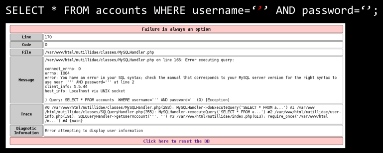
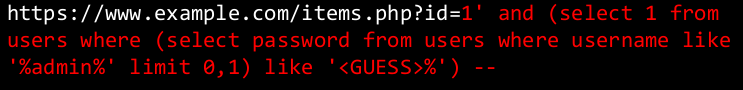
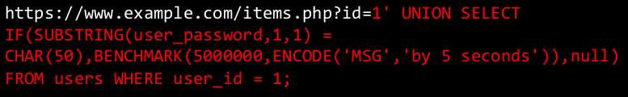
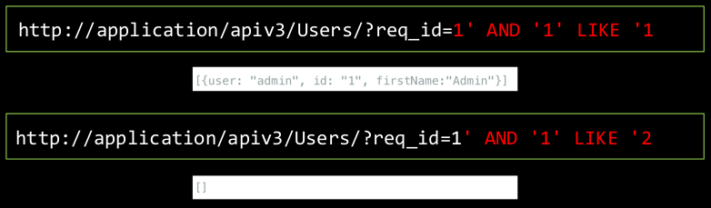

# Injection

The magic string when probing for vulnerabilities:

``` txt
‘”;<lol/>../--#`ls`
```

## SQL Injection


The database engine is not designed to tell the difference between **code** and **data**. It is generally a bad idea when ***control*** and ***data*** share the same **band**

### SQLI *TELLS*

Some *"tells"* for sql injection vulnerabilities:

#### Error messages



**protip**: API's often don't have error handling, and hide the error behind UI trickery (and status codes). Mobiles phones are twice as likely to be susceptible

Be wary of `'` and `"` when using SQL injection, there isn't a standard to use one or the other, so try both.

#### or 1=1


Not all products meet the first condition, **ALL** meet the second (1 is always equal to 1) so **ALL** records are returned!

#### and 1=1


The SAME legit record(s) should be returned as the uninjected equivalent, as the `name=product` condition is still met.


Now, if **NO** records are returned, we can be sure our injection is being processed.

#### Comments


Imagine if there is an unfavourable appendix on the end of a query, you can comment it out using the relevant DBMS ***inline comment*** syntax.  
The above query will instead be processed like this:

``` sql
SELECT * FROM USERS WHERE name='x';
```

Now, instead of returning one record, it will return ALL records that meet the condition in the query;

**Note**: Some programs trim trailing space which becomes a problem when we want to use inline commenting (`--`). To deal with this, just put something after the `--`; e.g. `-- extra stuff`

### OS Interactions

Under certain circumstances you can directly pop a shell on a vulnerable server running MSSQL AS THE DBMS.

`SELECT INTO OUTFILE` and `LOAD DATA INFILE` examples:

``` sql
LOAD DATA INFILE 'data.txt' INTO TABLE db2.my_table;
SELECT a,b,a+b INTO OUTFILE '/tmp/result.txt' FIELDS
    TERMINATED BY ',' OPTIONALLY ENCLOSED BY '"' LINES
    TERMINATED BY '\n' FROM test_table;
SELECT _utf8'Hello world!' INTO DUMPFILE '/tmp/world';
SELECT LOAD_FILE('/tmp/world') AS world;
```

``` sql
exec master.dbo.xp_cmdshell 'dtsrun -E -Sserver1 -N"Export Invoices"'
```

### SQLMAP

[sqlmap](https://github.com/sqlmapproject/sqlmap) is a pentesting tool that automates the process of detecting and exploiting SQL injection flaws and taking over of database servers.

It is generally not recommended for this course cause we want you to learn :)  

### Blink SQLI

**Blink SQLi** is when you can't directly exfiltrate data by selecting it into a column.

You can make the database do something depending on if a condition is true.  
*"Is the first letter of the password 'a'? If yes, sleep for 5 seconds, otherwise, do nothing"*  
From this exploit primitive, build a binary search tree.  
Dump data from the database via error codes/time delays.

``` sql
SELECT PRODUCT_COLOUR FROM PRODUCTS WHERE PRODUCT_ID=$PRODUCT AND (SUBQUERY TRUE OR FALSE);
```

Boolean-based blind injections:



Time-based blind injections:



### SQLI in Rest APIs



Generally APIs (especially APIs for mobile apps) have little if no protection again SQLi. These are great targets for testing SQLi.

### NOSQL Injections?

``` bson
db.users.find({username: username, password: password});
{ "username": {"$gt": ""}, "password": {"$gt": ""} }
```

### Preventing SQLI

SQL injections come from the confusion of **code** and **data**.

**Parametrised queries** force the SQL engine to cleanly segregate code and data:

``` mssql
string sql = "SELECT * FROM Customers WHERE CustomerId = @CustomerId";
SqlCommand command = new SqlCommand(sql);
command.Parameters.Add(new SqlParameter("@CustomerId",
System.Data.SqlDbType.Int));
command.Parameters["@CustomerId"].Value = 1;
```

Most languages have built-ins for the following forms of defence against SQLi:

* parameterisation/query binding
* escaping

When using user-provided data to perform a query, parameterisation should **ALWAYS** be used.

In PHP, `mysqli_real_escape_string()` is as safe as prepared statements **IF** you remember to use it every time.

**Reducing the attack surface** is another defensive measure against SQL injections. Here's what you can do on the layers of your application:

* Application layer
    * Handle your error messages gracefully
    * Filter user input
    * User parameterised queries where possible
* Database layer
    * Minimise the privilege level of your database user
    * Prevent arbitrary connections to your database server

**tl;dr: *trust nothing***
