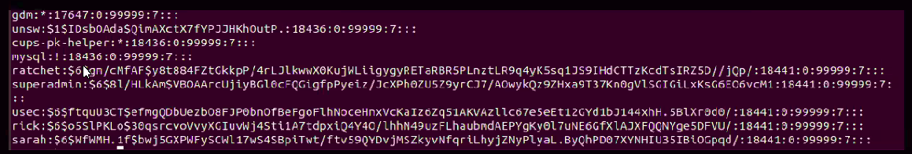

# Tutorial 5

New tutor: Joshua Murray  
Contact: joshua.murray@cba.com.au / secedu slack / openlearning group

## Content Review

### Command Injection

``` sh
8.8.8.8; id

cmd = "ping -c" + userinput
system(cmd)
```

### Directory Traversal

File inclusion directory traversal

``` sh
fi?page=../../../../etc/passwd
```

### Unrestricted File Upload

[WhiteWinterWolf PHP WebShells](https://github.com/WhiteWinterWolf/wwwolf-php-webshell)

Upload the file, then access it to run it.

Dangerous cause anyone can potentially use the webshell
Always read what the code is doing (look out for backdoors in webshells)

### XXE

XML is just a structured language.  
Sometimes you can inject input that ends up in the structure.  
A "parser" may then interpret it.

XML special powers:

* reading local files
* getting remote data

### SSRF

Make the server make the request.  
Lets you **hit internal** stuff! Anything it can reach  
Lots of protocols other than http exist.

## Challenge Hints

[CyberChef](https://gchq.github.io/CyberChef/) for various decodings and encodings

## Demonstrating Impact

Once you have control of the system you have the ability to influence **availability**, **confidentiality** or **integrity**.  
Penetration testers don't actively do this as they **don't want to hurt the company at all**, so there needs to be another way to demonstrate risks.

By getting the passwords stored on the compromised machine.

There are lots of methods for finding passwords in:

* Files
* Operating Systems
* Web Browsers
* Other programs and software

## Linux Passwords

There are a lot of variants but most commonly the important files are `/etc/passwd` and `/etc/shadow`. `/etc/passwd` doesn't actually contain passwords, `/etc/shadow` does. Usually password format is set to `$id$salt$hashed`.



The `$id` is the algorithm used on GNU/Linux is as follows:

1. `$1$` is MD5
2. `$2a$` is Blowfish
3. `$2y$` is Blowfish
4. `$5$` is SHA-256
5. `$6$` is SHA-512

Once we have a copy of `/etc/passwd` and `/etc/shadow` we convert it to the right format using unshadow

``` sh
unshadow passwd shadow > hashes.txt
```

We can feed it into John the Ripper to crack the passwords. It is important to choose a good wordlist. You can run it without a wordlist and use brute force.

``` sh
# with wordlist rockyou.txt
john hashes.txt --wordlist=/usr/share/wordlists/rockyou.txt --formatsha512crypt
# without wordlist
john hashes.txt
```

### Windows Passwords

To get Windows passwords we commonly do one of two things

* Dumping `lsass.exe`
* Getting the **registry hives** (SAM, SECURITY, SYSTEM)

`lsass.exe` stands for Local Security Authority Subsystem Service. It is just a process that is running. You can see it in the task manager.
